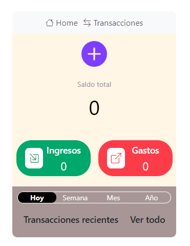
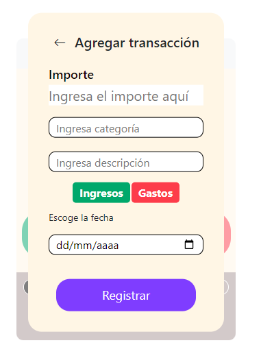
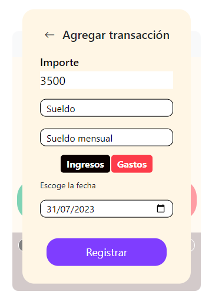
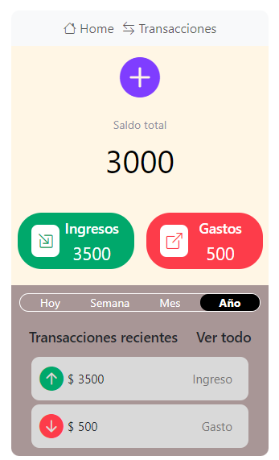
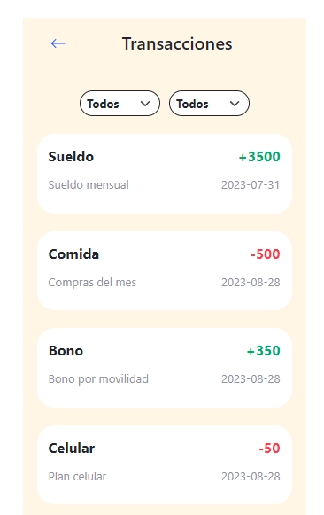

# Monedero local

Un proyecto que permite llevar un control de gastos e ingresos personales realizado con Javascript.

## Descripción

Este proyecto fue realizado para afianzar mis conocimientos en manipulación del DOM y LocalStorage
El proyecto permitirá guardar Ingresos y Gastos en el Local Storage, asimismo, te permitirá conocer en tiempo real las transacciones realizadas. Podrás visualizarlas por rangos de fechas o por tipo de operación (Ingreso o Gasto)

## Capturas de Pantalla

## Uso

Paso 1: Clickear el botón morado agregar transacción, ingresar los datos, seleccionando si la transacción es Ingreso o Compra.

Paso 2:La ventana de transacciones recientes se actualizará siempre con las 4 últimas transacciones.

Paso 3: Se puede acceder al nav e ir a listas de transacciones totales y seleccionar los filtros.

## Características

- JavaScript Puro
- CSS3 y Bootstrap 5
- Manejo del DOM y LocalStorage

## Licencia

Este proyecto se distribuye bajo la MIT.

## Contacto

Puedes contactarme en franciscod3v@gmail.com.

## Estado del Proyecto

En Desarrollo / Mantenimiento Activo